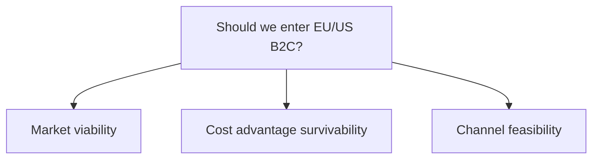
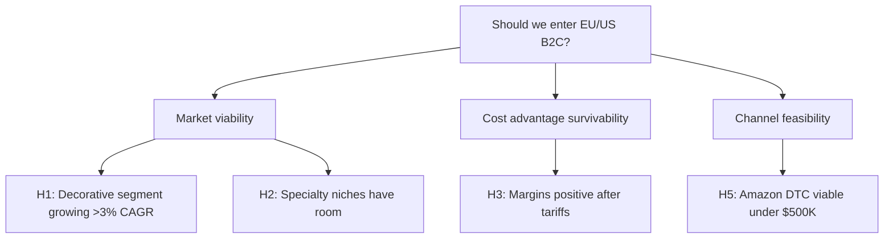

# Document Output Guide (.md, .docx, Notion)

**When to use:** User selected `--format md`, `--format docx`, or `--format notion`

**Read this file:** Phase 5 (Deliverable Creation), before building the document

---

## Documents vs Slides: Key Difference

**Documents = Linear narrative.** The reader progresses sequentially from beginning to end. Content flows continuously with section breaks, not discrete units. Depth and detail are expected.

**Slides = Modular units.** Each slide is self-contained. The reader can jump around. Brevity and visual impact are prioritized.

This guide covers documents. For slides, see `output-slides.md`.

---

## Document Structure (Pyramid Principle)

### 1. Executive Summary (1-2 pages)

Lead with the answer. This is the most important section — many readers will only read this.

**Content:**
- 5-15 key conclusions as bullet points
- Each bullet = one major finding or recommendation
- No charts here — pure text for quick scanning
- Answer the core question directly in the first paragraph

**Example structure:**
```
# Executive Summary

[Client] should enter the EU/US B2C paint market via Amazon DTC with a phased launch starting in the UK. This recommendation is based on three key findings:

- **Market is attractive:** EU decorative paint market is €12B growing at 3.2% CAGR, with specialty eco-friendly segment growing 2x market rate. Consumer demand for sustainable alternatives is validated by survey data (N=3,277).

- **Cost advantage survives:** Our 38% manufacturing cost advantage vs. local producers remains positive after tariffs (15%), shipping ($8.50/unit), and compliance costs. Landed cost positions us competitively between mass market ($25) and premium ($60) price points.

- **Amazon DTC is feasible under $500K:** Launch cost estimated at $180K based on 3 crable case studies. Breakeven projected at 14 months with conservative assumptions. Retail partnership requires >$2M minimum and 18-24 month timeline.
```

### 2. Situation / Context (1-2 pages)

Set the stage. Where things stand today, why this question matters, what's at stake.

**Content:**
- Current state of the business/market
- Why this decision is being made now
- Scope of analysis (what's in, what's out)
- Key constraints or assumptions

**BCG pattern:** Use "From... To..." framing if this is a transformation narrative.

### 3. Analysis Sections (3-5 sections, 2-4 pages each)

Each section = one storyline from the issue tree. These are the deep-dive sections where you present evidence and build the argument.

**Structure per section:**

#### Section Headline (H2)
State the conclusion, not the topic. "Market is attractive for new entrants" not "Market Overview."

#### Framing Paragraph
Open with the key insight in 2-3 sentences. This paragraph should stand alone — if someone only reads this, they get the point.

#### Evidence (3+ pieces per section)
- Quantitative data with sources: "EU decorative paint market is €12B, growing at 3.2% CAGR from '23 to '30 (Euromonitor 2025)"
- Benchmarking: Named competitors, specific numbers, "Implications to [client]" after each comparison
- Case studies: What they did, outcomes, lessons for this client (see Case Study Standards below)
- Logical reasoning chains: "If X, then Y, therefore Z"
- Qualitative observations: Expert quotes, consumer feedback, industry patterns

**Tables preferred over prose for data-heavy content.** Use tables for:
- Competitor comparisons (3-5 competitors × 3-5 dimensions)
- Benchmarking (our metrics vs. industry median/top quartile)
- Segmentation (4-6 segments with size, characteristics, priority)
- Financial breakdowns (cost structure, revenue model)

#### "Implications to [Client]" Callout
After presenting evidence, explicitly state what it means for the client's decision. This is mandatory — don't just present data and move on.

**Example:**
> **Implications to [Client]:** The 3.2% CAGR in decorative paint, combined with 2x growth in the eco-friendly segment, creates a window for new entrants. Incumbents' reformulation cycles are 2-3 years, giving us time to establish brand presence before they respond. Focus on the specialty segment where our eco-credentials are a differentiator, not the mass market where we'd compete on price alone.

#### Connection to Next Section
End with a transition sentence that links to the next storyline. The narrative should flow.

### 4. Recommendations (1-2 pages)

Specific, actionable next steps with prioritization.

**Content:**
- What to do (specific actions, not vague advice)
- Why (tie back to evidence from analysis sections)
- When (timeline, sequencing, dependencies)
- Who (roles/functions responsible)
- How much (budget, resources required)

**Prioritization:** Use "Phase 1 / Phase 2" or "Immediate / Near-term / Long-term" to sequence actions.

**Example:**
```
## Recommendations

### Phase 1: UK Market Entry (Months 1-6, ~$180K)
1. **Launch on Amazon UK** — Set up seller account, list 3-5 SKUs (eco-friendly interior paint line). Target: 500 units/month by Month 3.
2. **Localize packaging** — Translate labels, obtain UK regulatory compliance (VOC limits, safety data sheets). Cost: ~$15K.
3. **Run targeted PPC campaigns** — Focus on "eco paint UK" and "sustainable home improvement" keywords. Budget: $5K/month.

### Phase 2: EU Expansion (Months 7-12, ~$120K)
1. **Add Germany and France** — Replicate UK playbook with localized listings. Leverage UK customer reviews for social proof.
2. **Test retail partnership** — Approach 2-3 specialty retailers (e.g., eco-focused home improvement chains) with UK sales data as proof of concept.
```

### 5. Risks & Mitigations (optional, 1 page)

Only include if the decision carries meaningful downside. Not every deliverable needs this.

**Content:**
- What could go wrong (specific risks, not generic "market risk")
- Likelihood and impact (high/medium/low)
- How to mitigate (specific actions)
- Early warning indicators (what to monitor)

### 6. Appendix (as needed)

Detailed data tables, methodology notes, extended analysis that didn't fit in main sections.

**Content:**
- Full data tables (if main sections showed summaries)
- Methodology (how you sized the market, calculated costs, etc.)
- Additional case studies
- Sensitivity analysis (financial models with different assumptions)
- Source list (if not using footnotes)

---

## Content Density Standards

**Every H2 section must have:**
1. Framing paragraph (key insight)
2. 3+ evidence points with sources
3. At least one comparison or benchmark
4. "Implications to [client]" callout

**No Wikipedia-style summaries.** Every section must advance the argument. If a section doesn't support a recommendation or answer the core question, cut it.

**Minimum output by `--length`:**
- `3min`: 800-1200 words OR 60% of research volume, whichever is higher
- `5min`: 2000-2500 words OR 60% of research volume, whichever is higher
- `10min`: 4000-5000 words OR 60% of research volume, whichever is higher
- `10min+`: 6000+ words OR 60% of research volume, whichever is higher

The process YAML files collectively will often exceed 20K words of research — the deliverable should reflect that coverage, not compress it into a thin summary.

---

## Writing Style Standards

### Structured and Communicational: Mix Prose with Bullets

Documents should combine explanatory prose with structured bullet points, numbered lists, headers, tables, and visual elements. This makes content easier to scan and digest while maintaining analytical depth.

**Use prose for:**
- Opening paragraphs that frame the section
- Explanations of why findings matter
- Transitions between topics
- Synthesis and implications

**Use bullets for:**
- Lists of findings or evidence points
- Key data points with sources
- Action items or recommendations
- Comparisons or options

**Use numbered lists for:**
- Sequential steps or phases
- Prioritized recommendations
- Ranked options or alternatives

**Use tables for:**
- Multi-dimensional comparisons (competitors, segments, scenarios)
- Financial breakdowns
- Benchmarking data

**Use headers (H1, H2, H3) for:**
- H1: Document title
- H2: Major sections (Market Viability, Cost Analysis, Recommendations)
- H3: Subsections within major sections

**Example of good structure:**

> ## Market Viability
>
> The EU decorative paint market presents a compelling opportunity for [Client], driven by structural growth in the specialty eco-friendly segment and favorable competitive dynamics.
>
> ### Market Size and Growth
>
> **Key findings:**
> - EU decorative paint market: €12B, growing at 3.2% CAGR (2023-2030) (Euromonitor 2025)
> - Specialty eco-friendly segment: 6.8% CAGR — more than double the overall market rate
> - Consumer willingness to pay: 68% willing to pay 15-20% premium for sustainable paint (Consumer survey, N=3,277, Jan 2025)
>
> This growth differential indicates a structural shift in consumer preferences toward sustainable products, not just a temporary trend. The 6.8% CAGR has persisted for 3+ years across multiple geographies, suggesting durability.
>
> ### Competitive Window
>
> Incumbents face significant barriers to rapid response:
>
> 1. **Reformulation cycles**: 2-3 years to develop and launch new eco-friendly lines
> 2. **Brand repositioning**: Established brands risk cannibalizing existing mass-market products
> 3. **Distribution conflicts**: Retail partners resist SKU proliferation
>
> This creates a 2-3 year window for new entrants to establish brand presence before competitive response.
>
> **Implications for [Client]:**
> Positioning in the eco-friendly segment is not just differentiation — it's riding a growth wave that will compound your advantage over time. Focus product development and marketing on sustainability credentials rather than competing on price in the mass market.

### Visual Elements for Documents

Use visual elements to break up text and make data more digestible:

**Tables for comparisons:**

| Competitor | Market Share | Pricing | Distribution | Recent Moves |
|------------|--------------|---------|--------------|--------------|
| Competitor A | 18% (€2.2B) | Premium ($50-60) | Retail 70%, DTC 30% | Launched eco line 2024 |
| Competitor B | 12% (€1.4B) | Mass ($20-30) | Retail 95%, B2B 5% | Acquired distributor 2023 |
| Competitor C | 8% (€960M) | Mid-tier ($35-45) | DTC 60%, Retail 40% | Expanded to US 2024 |

**ASCII charts for financial breakdowns:**

```
Revenue per unit:     $45.00  ████████████████████████████████████
- COGS:              -$12.00  ██████████
- Shipping:           -$8.50  ███████
- Platform fees:      -$6.75  █████
                             ─────────────────────────────────────
= Net margin:         $17.75  ███████████████  (39.4%)
```

**Mermaid diagrams for flows and trees:**



**Callout boxes for key implications:**

> **Key Takeaway:** The 2-3 year competitive window, combined with 6.8% segment growth, creates a rare opportunity for early movers to establish brand presence before incumbents respond.

### Avoid Telegraphic Bullets

While bullets are useful for structure, avoid telegraphic style that reads like notes:

**Don't do this (telegraphic):**
> • EU market: €12B, 3.2% CAGR
> • Eco segment: 6.8% CAGR
> • Incumbents slow (2-3 years)

**Do this (structured but explanatory):**
> **Key findings:**
> - EU decorative paint market: €12B, growing at 3.2% CAGR (2023-2030) (Euromonitor 2025)
> - Specialty eco-friendly segment: 6.8% CAGR — more than double the overall market rate
> - Incumbent response time: 2-3 years due to reformulation cycles, creating entry window

### Explain the Why and How, Not Just the What

Every finding should answer three questions:
1. **What** is the finding? (the data point)
2. **Why** does it matter? (the implication)
3. **How** does it connect to the recommendation? (the action)

**Example:**
> **What:** The specialty eco-friendly segment is growing at 6.8% CAGR, more than double the overall market rate of 3.2%.
>
> **Why:** This indicates a structural shift in consumer preferences toward sustainable products, not just a temporary trend. The growth differential has persis years across multiple geographies.
>
> **How:** For [Client], this means positioning in the eco-friendly segment is not just differentiation — it's riding a growth wave that will compound your advantage over time. Focus product development and marketing on sustainability credentials rather than competing on price in the mass market.

### Use Concrete Examples and Narratives

Abstract statements are forgettable. Concrete examples with specific details stick in the reader's mind.

**Abstract:**
> "DTC paint brands can succeed with proper brand investment."

**Concrete:**
> "Clare Paint launched DTC-only in 2018 with a $7.5M Series A, focusing on Instagram-first marketing and a simplified SKU count (12 colors vs. 200+ for traditional brands). By 2020, they had reached $15M revenue and became a top-5 DTC paint brand in the US. Their success came from strong brand identity and social proof, but they struggled with high CAC ($180 per customer) and couldn't crack the contractor channel, which remains 60% of the market."

### Transitions Between Sections

Every section should flow into the next. The last sentence of Section A should set up Section B.

**Example:**
> [End of Market Viability section]
> "While the market opportunity is clear, the critical question is whether our cost advantage can survive the journey from Vietnam to EU/US shelves — which we examine next."
>
> [Start of Cost Advantage section]
> "Our 38% manufacturing cost advantage vs. local producers is substantial, but tariffs, shipping, and compliance costs will erode it..."

### Paragraph Structure

Each paragraph should have:
- **Opening sentence**: States the main point
- **Supporting sentences**: Provide evidence, examples, or reasoning (2-4 sentences)
- **Closing sentence**: Connects to the next idea or reinforces the implication

**Example:**
> The specialty eco-friendly segment represents the most attractive entry point for [Client]. This segment is growing at 6.8% CAGR — more than double the overall market rate — and consumer willingness to pay a 15-20% premium is validated by survey data (N=3,277). Incumbents are slow to respond due to 2-3 year reformulation cycles, creating a window for new entrants. This growth trajectory, combined with regulatory tailwinds from tightening EU VOC limits in 2026, makes the eco segment a strategic priority rather than a niche play.

---

## Case Study Standards

**See `references/templates/yaml-formats.md` for complete case study requirements (4 dimensions: what they did, outcomes, what worked/didn't work, lesson for client).**

For documents: Present 1-2 key case studies with all 4 dimensions in narrative form. Supporting comparables can be brief mentions with sources.

---

## Benchmarking Standards

**Always use named competitors, not "industry peers."** Identify 3-5 specific companies.

**For each competitor, include:**
- What they do differently (strategy, positioning, channel)
- Quantitative comparison (market share, pricing, margins, growth rate)
- Why it matters (what we can learn or how we compare)

**Multi-dimensional benchmarking table (required for at least one comparison):**

| Competitor | Market Share | Pricing Strategy | Distribution Channels | Recent Strategic Moves |
|------------|--------------|------------------|----------------------|------------------------|
| Competitor A | 18% (€2.2B) | Premium ($50-60/unit) | Retail (70%), DTC (30%) | Launched eco line 2024 |
| Competitor B | 12% (€1.4B) | Mass market ($20-30) | Retail (95%), B2B (5%) | Acquired distributor 2023 |
| Competitor C | 8% (€960M) | Mid-tier ($35-45) | DTC (60%), Retail (40%) | Expanded to US 2024 |
| **[Client]** | 0% (new entrant) | TBD ($40-50 target) | DTC (Amazon) | — |

**After every benchmark, add "Implications to [client]" — not just "Competitor X has 47% margin."**

---

## Format-Specific Guidance

### Markdown (.md)

**Capabilities:**
- Headers (H1, H2, H3), bold, italic, lists, tables
- Code blocks for financial models or formulas
- Mermaid diagrams for flows/trees (if rendering supports it)
- ASCII art for simple visualizations

**Tables:**
```markdown
| Metric | Our Cost | Competitor Avg | Top Quartile |
|--------|----------|----------------|--------------|
| COGS per unit | $12.00 | $18.50 | $15.20 |
| Shipping | $8.50 | $6.20 | $5.80 |
| Landed cost | $20.50 | $24.70 | $21.00 |
```

**ASCII art for driver trees or waterfalls:**
```
Revenue per unit:     $45.00  ████████████████████████████████████
- COGS:              -$12.00  ██████████
- Shipping:           -$8.50  ███████
- Platform fees:      -$6.75  █████
                             ─────────────────────────────────────
= Net margin:         $17.75  ███████████████  (39.4%)
```

**Mermaid for issue trees:**


**Citations:** Use footnotes or a References section at the end. Don't scatter inline citations — they break narrative flow.

**Source URL Requirements:**
- Every citation must include a retrievable URL, not just the source name
- ✅ "Euromonitor 2025 (https://www.euromonitor.com/paint-market-eu-2025)"
- ❌ "Euromonitor 2025" (not retrievable)
- For paywalled sources: Include URL + note "(subscription required)"
- For model estimates: Label as "Model estimate (not verified)" in citation

### Word (.docx)

**Nested skill:** `skills/docx/SKILL.md` — Read this file first to understand capabilities.

**Key capabilities:**
- Professional formatting (headers, footers, page numbers)
- Tables with borders and shading
- Images (charts, diagrams)
- Table of contents (auto-generated from headings)
- Footnotes for citations
- Tracked changes and comments (if iterating with user)

**Critical rules from docx skill:**
- Set page size explicitly (US Letter: 12240 x 15840 DXA, not A4 default)
- Use Arial as default font (universally supported)
- Never use unicode bullets — use `LevelFormat.BULLET` with numbering config
- Tables need dual widths: `columnWidths` array AND cell `width`, both in DXA
- Always use `WidthType.DXA` for tables (never PERCENTAGE — breaks in Google Docs)
- Use `ShadingType.CLEAR` for table shading (not SOLID)
- PageBreak must be inside a Paragraph
- Override built-in heading styles with exact IDs: "Heading1", "Heading2"

**Table example (from docx skill):**
```javascript
new Table({
  width: { size: 9360, type: WidthType.DXA }, // Full width (US Letter with 1" margins)
  columnWidths: [4680, 4680], // Must sum to table width
  rows: [
    new TableRow({
      children: [
        new TableCell({
          width: { size: 4680, type: WidthType.DXA },
          shading: { fill: "D5E8F0", type: ShadingType.CLEAR },
          margins: { top: 80, bottom: 80, left: 120, right: 120 },
          children: [new Paragraph({ children: [new TextRun("Cell content")] })]
        })
      ]
    })
  ]
})
```

**Validation:** After generating, always run `python scripts/office/validate.py output.docx` to catch issues.

### Notion

**Nested tool:** Notion MCP (requires configuration — see `references/workflow/setup-guide.md`)

**Read:** `references/templates/output-notion.md` for Notion-specific formatting and MCP usage.

**Key differences from .md/.docx:**
- Notion uses blocks (paragraph, heading, table, callout, etc.)
- Collaborative editing — user can continue editing after you create it
- Supports databases (tables with properties, filters, views)
- Callout blocks for "Implications to [client]" sections
- Toggle blocks for appendix content (collapsed by default)

**When to use Notion:**
- User wants collaborative editing with their team
- Deliverable will be living document (updated over time)
- User already uses Notion for other work

---

## Reading from YAML Files

**Source of truth:** All expert findings are in `process/workstream-*.yaml` files.

**How to use them:**

1. **Read all YAML files** in `process/` directory
2. **Organize by storyline, not by expert** — multiple experts may contribute to the same storyline
3. **Extract:**
   - `key_findings` → main evidence points
   - `data_points` → quantitative data with sources
   - `implications` → "so what for client"
   - `charts_suggested` → visualizations to include
   - `case_studies` → examples with all 4 dimensions
   - `benchmarking` → competitor comparisons
4. **Preserve source citations** — every data point has `source_type` and `source_url`
5. **Check confidence levels** — `data_gaps` field lists missing data, flag these in the document

**Example YAML structure:**
```yaml
workstream_name: "cost-advantage-analysis"
key_findings:
  - finding: "38% cost advantage survives tariffs and shipping"
    confidence: "high"
    evidence_type: "quantitative"

data_points:
  - metric: "Manufacturing cost per unit"
    value: "$12.00"
    source_type: "verified"
    source_url: "https://..."

implications: "Cost advantage positions us competitively between mass market ($25) and premium ($60). Focus on mid-tier positioning to maximize margin while remaining accessible."

charts_suggested:
  - type: "waterfall"
    title: "Cost Breakdown: Our Landed Cost vs. Competitors"
    description: "Shows how our $12 COGS advantage survives after tariffs and shipping"
```

**Don't just copy-paste YAML content.** Synthesize findings into a coherent narrative. The PL adds transitions, cross-references between workstreams, and the "so what" synthesis layer.

---

## Quality Checklist (Pre-Delivery)

Before presenting the document to the user, verify:

- [ ] **Executive summary leads with the answer** — core recommendation in first paragraph
- [ ] **Every H2 section has:** framing paragraph + 3+ evidence points + comparison + "Implications to [client]"
- [ ] **Every claim has a source** — footnotes or references section
- [ ] **Benchmarking uses named competitors** — not "industry peers"
- [ ] **Case studies include all 4 dimensions** — what/outcomes/lessons/implications (for 1-2 key examples)
- [ ] **Narrative flows logically** — transitions between sections, storylines connect
- [ ] **Length matches user's `--length` target** — 3min/5min/10min/10min+ (see SKILL.md for word counts)
- [ ] **No orphan evidence** — every data point connects to a storyline and supports a recommendation
- [ ] **Tables used for data-heavy content** — not prose paragraphs
- [ ] **"Implications to [client]" after every major finding** — not just data presentation
- [ ] **Minimum output met** — 3000-4000 words (standard) or 5000-7000 words (deep), OR 60% of research volume, whichever is higher
- [ ] **Format-specific validation passed** — `validate.py` for .docx, rendering check for .md, MCP success for Notion

**Read `references/workflow/pre-delivery-checklist.md` for complete quality standards.**

---

## Common Mistakes to Avoid

1. **Topic-only headers** — "Market Overview" instead of "Market is attractive for new entrants"
2. **Data dumps without implications** — presenting numbers without saying what they mean for the client
3. **Vague recommendations** — "explore partnerships" instead of "approach 2-3 specialty retailers with UK sales data"
4. **Generic competitors** — "industry peers" instead of "Uniqlo, Heilan, Nike"
5. **Thin sections** — one paragraph with no evidence or comparison
6. **No benchmarking** — missing the "vs. industry median/top quartile" comparison
7. **Incomplete case studies** — only "what they did" without outcomes or lessons
8. **Orphan evidence** — interesting data that doesn't support any recommendation
9. **No synthesis** — just concatenating expert YAML files without adding narrative arc
10. **Wrong format defaults** — using A4 for .docx (should be US Letter), using PERCENTAGE for table widths (breaks in Google Docs)

---

## Deliverable Advisor Role

**You are responsible for:**
1. **Structure proposal** — Send proposed outline to PL for approval before building (see `workflow/phases-overview.md` Phase 5)
2. **Building the document** — Read YAML files, synthesize into narrative, apply format-specific best practices
3. **Quality verification** — Run pre-delivery checklist before presenting to user
4. **Iteration** — Incorporate PL feedback (max 3 revision rounds)

**You are NOT responsible for:**
- Creating new analysis or findings (that's the Business Experts' job)
- Changing conclusions (use what's in the YAML files)
- Deciding strategic direction (that's the PL's job)

**If you find yourself rewriting expert analysis from scratch, that's a sign the expert prompt was too vague. Flag this to the PL — don't compensate by doing the expert's job.**

---

## BCG Patterns to Follow

**Read `references/methodology/bcg-patterns.md` for complete consulting patterns.**

Key patterns for documents:
- Lead with the answer (executive summary first)
- Every section ends with "Implications to [client]"
- Use specific numbers and named competitors
- Frame transformation as numbered levers
- Footnotes are mandatory for all data

---

## Final Note

Documents are about depth and narrative flow. Unlike slides (which are modular and visual), documents allow you to build a sustained argument with detailed evidence. Use that space wisely — every section should advance the storyline and support the recommendation.

The reader should be able to follow your logic from problem → evidence → conclusion → recommendation without gaps or leaps.
